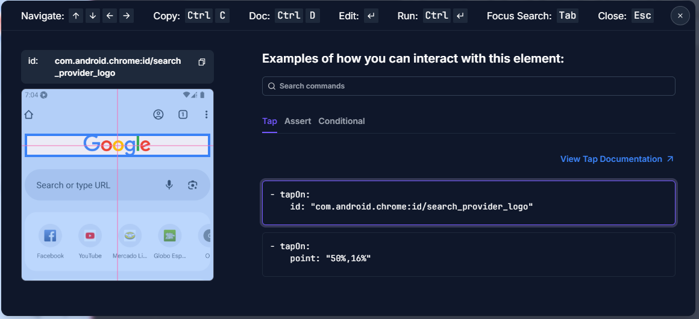

# teste Maestro

* Testes na interface WEB + VS Code e Emulador
* Teste simples de cliques

## Testes com Maestro

* Seguir os documentos na pasta **totoriais**

## Comandos básicos

* No terminal, rodar: **maestro test android-flow.yaml** ou **maestro test ios-flow.yaml** - vai rodar o teste do arquivo
* No terminal, rodar: **maestro studio** - vai abrir a parte web para inspeção e testes

## Documentações de Referências

* **Maestro Framework** - https://maestro.mobile.dev/
* **Maestro Clound** - https://console.mobile.dev/

## Rodando as configurações Maestro Studio

* Abrir o link: **http://localhost:9999/interact** para acessar o inspetor de elementos, abaixo o exemplo:

* 

## Desafios e Estudos

* * Teste com Device Farms + Maestro Clound